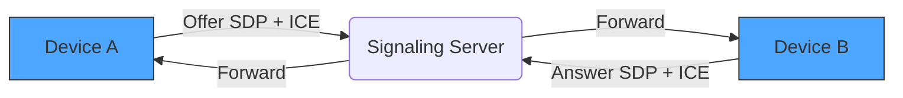
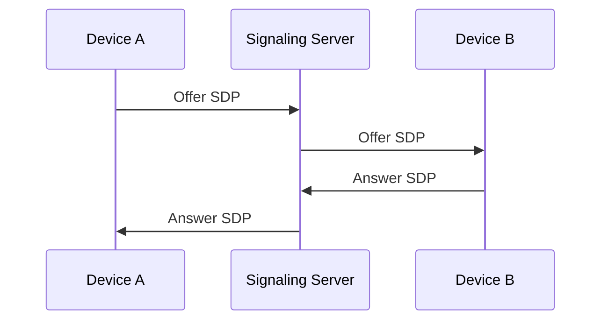
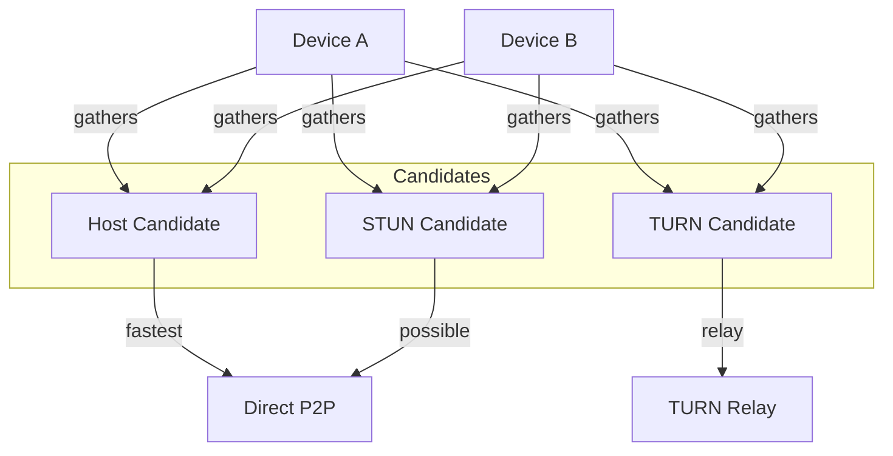
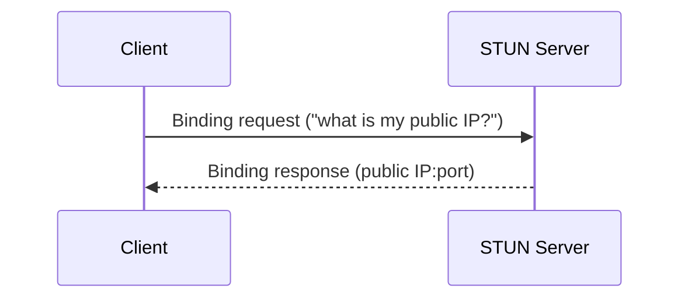
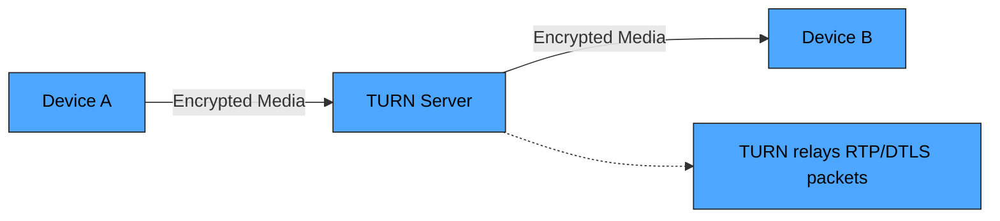
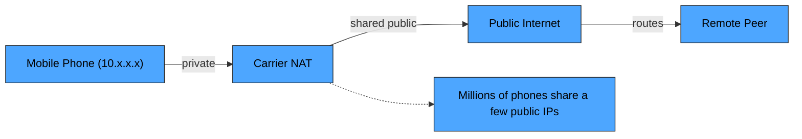
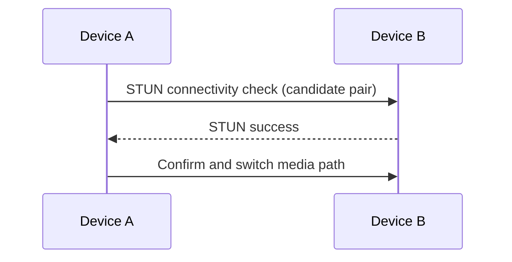

Real-time communication powers everything we use today — video calls, voice calls, live streaming, multiplayer games, and even real-time chat.

But how do two devices talk directly over the internet?

The secret behind all of this is **WebRTC**.

In this blog, we’ll break down WebRTC from the ground up:

* What WebRTC really does
* What Signaling, SDP, and ICE are
* What Host, STUN, and TURN candidates are
* Why NAT creates problems
* Why mobile network users are always behind NAT
* And why TURN sometimes becomes mandatory

By the end, you’ll understand WebRTC like a pro.

## **What is WebRTC?**

**WebRTC (Web Real-Time Communication)** is a technology that allows browsers and apps to communicate peer-to-peer without needing a server in the middle for audio/video/data transfer.

WebRTC makes possible:

* Video calling
* Voice calling
* Live screen sharing
* File transfer
* Real-time chat (via DataChannel)

Once the connection is established → the data flows directly between devices.

But establishing that connection is the tricky part.

## **Why Peer-to-Peer Is So Hard?**

Because almost every device on the internet is behind a **NAT**.

It doesn’t matter if you're using:

* Home WiFi
* Broadband
* Mobile data (SIM)
* Corporate network
* Public WiFi

All of these use some type of NAT or firewall.

To bypass this, WebRTC depends on:

* **Signaling**
* **SDP (Offer/Answer)**
* **ICE (Connectivity process)**
* **ICE Candidates (Host / STUN / TURN)**

## **1) What is Signaling?**

Signaling is how two devices exchange the initial information needed to start a WebRTC connection.

This includes:

* Their SDP
* Their ICE candidates
* Their media settings
* Their "Hey, I want to connect" messages

Signaling is **not part of WebRTC** itself — it’s just the method of sending messages between peers.

You can use:

* WebSocket
* Socket.io
* Firebase
* REST API
* Even manual copy-paste (for testing)

Once both devices exchange the required info → signaling is done.

## **2) What is SDP?**

**SDP (Session Description Protocol)** is a long text description containing:

* Audio/Video codecs
* Encryption details
* Number of media tracks
* DataChannel info
* Network capabilities
* Offer/Answer details

SDP basically tells:

> **“Here is how I want to communicate. Tell me how you want to respond.”**

WebRTC uses:

* **Offer SDP** → created by the first device
* **Answer SDP** → created by the second device

Without SDP, devices won’t understand each other’s capabilities.

## **3) What is ICE?**

**ICE = Interactive Connectivity Establishment**

It’s a smart process WebRTC uses to discover:

* How devices can reach each other
* Which path is the fastest
* Which path is even possible

ICE collects different candidates (possible connection routes).

There are 3 types:

1. **Host Candidate** → local network address
2. **STUN Candidate** → public IP address
3. **TURN Candidate** → relay server (last resort)

ICE tests all possibilities and automatically selects the best one.

## **4) ICE Candidate Types Explained**

### A) Host Candidates

These are local IP addresses, like:

* 192.168.x.x
* 10.x.x.x

Used when both devices are:

* On the same WiFi
* On the same LAN

Fastest possible connection.

###  B) STUN Candidates

A STUN server’s job:

> **“Tell me what my public IP looks like on the internet.”**

Because NAT hides your real public address, STUN helps your device discover it.

Used for normal real-world P2P.

But STUN can fail on:

* Strict firewalls
* Mobile networks
* Corporate networks

###  C) TURN Candidates (Relay)

If direct P2P is impossible, a **TURN server** becomes a relay:

**Device A → TURN → Device B**

TURN is slower but **guarantees connection**.

Required in:

* Mobile data networks
* Corporate networks
* Public WiFi
* CGNAT (Carrier-grade NAT)
* Very strict firewalls

TURN is the **last hope** of WebRTC.

## **NAT in Mobile Data (SIM Internet)**

Most people think:

> **“I don’t have a router, so I don’t have NAT.”**

Wrong.

Mobile networks use a massive NAT system called:

### **CGNAT (Carrier-Grade NAT)**

Your phone actually gets a private IP like **10.x.x.x**, not a real public IP.

Millions of users share a few public IPs.

This makes mobile networks extremely strict:

* Direct P2P usually fails
* STUN candidates may not work
* TURN becomes necessary

This is why WebRTC sometimes struggles on 4G/5G networks without TURN.

## **ICE Connectivity Check (how candidates are tested)**

This process repeats across candidate pairs until a working pair is found.

---

## **Summary**

| Concept            | Meaning                     | When Used         |
| ------------------ | --------------------------- | ----------------- |
| **Signaling**      | Exchange connection info    | Before connecting |
| **SDP**            | Media + network description | Offer/Answer      |
| **ICE**            | Finds best connection path  | NAT traversal     |
| **Host Candidate** | Local IP                    | Same network      |
| **STUN Candidate** | Public IP discovery         | Normal P2P        |
| **TURN Candidate** | Relay server                | Strict networks   |
| **Mobile Data**    | Always behind CGNAT         | Requires TURN     |

## **Conclusion**

WebRTC is incredibly powerful — enabling P2P communication without needing a central media server.

But to make this work, it must deal with:

* NAT
* Firewalls
* Mobile network restrictions
* Different internet conditions

That’s why WebRTC uses:

* **SDP**
* **ICE**
* **STUN**
* **TURN**

Together, they create a stable P2P connection under almost every condition.
